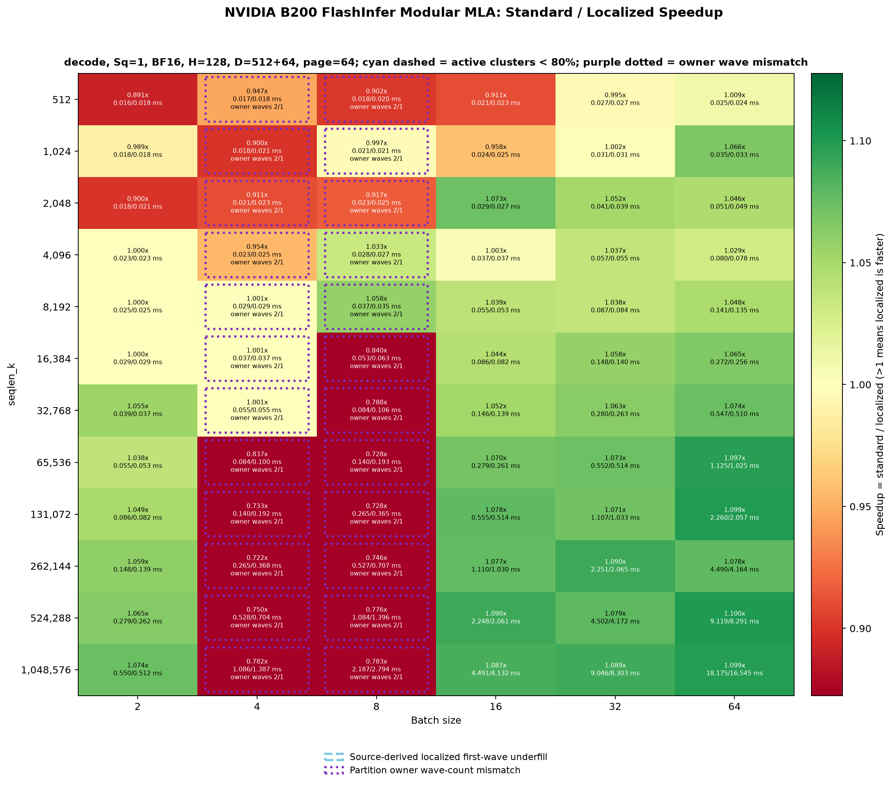

# B200 asymmetry-oblivious MLA decode experiment

All 72 Sq=1 points passed exact output/LSE checks. Equal work exposes a substantial regression at B=4/8: for Sk >= 65536, localized latency is geometrically 30.9%/33.0% higher than standard. These batches assign 36 tasks to each partition, but P0 has only 35 clusters, requiring a second persistent wave while P1's 39 clusters need one. The other batches assign 32/32 tasks and retain long-sequence gains. This explanation follows the scheduler geometry; no per-partition timeline profiling was performed.

Whole-matrix geometric-mean speedup is 0.9776x (2.29% higher latency); 44 wins, 3 ties, 25 losses. Worst point: B=4, Sk=262144, 0.265312 ms standard vs 0.367600 ms localized (0.7217x, 38.55% higher latency). Maximum per-mode block spread is 3.95%.

Standard baseline is unchanged. Only localized decode's host-side work cut changes: `work_p0 = (batch_size * split_kv) // 2`. The device scheduler consumes this cut; its physical SM map, cluster ranks and partition-local stride still reflect the real 70/78 SM topology. KV pages follow the same cut so all scheduled reads remain local.

BF16 random input (seed 42), H=128, latent/RoPE=512/64, page=64, PDL off. Sq=1, B=2/4/8/16/32/64, Sk=512 through 1048576. Each point verifies equal task/page counts and bitwise output/LSE equality before timing. Allocation, initialization, scatter and correctness checks are outside timing. Maximum paired KV is 144 GiB.

Timing reuses the existing cold-L2 Triton CUDA-event benchmark: 20 paired warmups, four AB/BA/BA/AB blocks, 500 ms warmup and 1000 ms measurement per mode per block, at least 20 samples. Latency is the median of four block medians. Speedup = standard / localized; below 1 means the equal-work localized kernel is slower. GPU clocks are not locked. This experiment compares against standard, not against a freshly measured SM-proportional localized implementation.

| Sq | Region | Localized wins | Geomean speedup | Range |
| --- | --- | --- | --- | --- |
| 1 | all | 44/72 | 0.9776x | 0.7217–1.0998x |
| 1 | Sk >= 16384 | 29/42 | 0.9699x | 0.7217–1.0998x |
| 1 | Sk >= 65536 | 20/30 | 0.9586x | 0.7217–1.0998x |
| 1 | B=2, Sk >= 65536 | 5/5 | 1.0569x | 1.0381–1.0740x |
| 1 | B=4, Sk >= 65536 | 0/5 | 0.7637x | 0.7217–0.8367x |
| 1 | B=8, Sk >= 65536 | 0/5 | 0.7520x | 0.7276–0.7829x |
| 1 | B=16, Sk >= 65536 | 5/5 | 1.0805x | 1.0702–1.0904x |
| 1 | B=32, Sk >= 65536 | 5/5 | 1.0806x | 1.0714–1.0900x |
| 1 | B=64, Sk >= 65536 | 5/5 | 1.0946x | 1.0785–1.0998x |

## Geometry

| Sq | B | split_kv | Tasks P0/P1 | Tiles P0/P1 | Waves P0/P1 |
| --- | --- | --- | --- | --- | --- |
| 1 | 2 | 32 | [32, 32] | [32, 32] | [1, 1] |
| 1 | 4 | 18 | [36, 36] | [36, 36] | [2, 1] |
| 1 | 8 | 9 | [36, 36] | [36, 36] | [2, 1] |
| 1 | 16 | 4 | [32, 32] | [32, 32] | [1, 1] |
| 1 | 32 | 2 | [32, 32] | [32, 32] | [1, 1] |
| 1 | 64 | 1 | [32, 32] | [32, 32] | [1, 1] |

## Sq=1 speedup matrix

Colors match localized_mla_b200_74_74_20260905 decode Sq=1: RdYlGn, centered at 1.0, range 0.872427–1.127573x. Values outside this range use the endpoint colors; cell labels retain the actual measurements.



| Sk / B | 2 | 4 | 8 | 16 | 32 | 64 |
| --- | --- | --- | --- | --- | --- | --- |
| 512 | 0.8908 | 0.9471 | 0.9016 | 0.9105 | 0.9952 | 1.0092 |
| 1024 | 0.9887 | 0.9002 | 0.9969 | 0.9584 | 1.0021 | 1.0658 |
| 2048 | 0.9002 | 0.9106 | 0.9168 | 1.0731 | 1.0518 | 1.0460 |
| 4096 | 1.0000 | 0.9545 | 1.0329 | 1.0035 | 1.0370 | 1.0295 |
| 8192 | 1.0000 | 1.0011 | 1.0578 | 1.0391 | 1.0375 | 1.0477 |
| 16384 | 1.0000 | 1.0009 | 0.8401 | 1.0435 | 1.0576 | 1.0648 |
| 32768 | 1.0546 | 1.0006 | 0.7881 | 1.0523 | 1.0628 | 1.0738 |
| 65536 | 1.0381 | 0.8367 | 0.7284 | 1.0702 | 1.0734 | 1.0974 |
| 131072 | 1.0492 | 0.7328 | 0.7276 | 1.0782 | 1.0714 | 1.0988 |
| 262144 | 1.0590 | 0.7217 | 0.7464 | 1.0774 | 1.0900 | 1.0785 |
| 524288 | 1.0645 | 0.7504 | 0.7765 | 1.0904 | 1.0790 | 1.0998 |
| 1048576 | 1.0740 | 0.7824 | 0.7829 | 1.0866 | 1.0895 | 1.0985 |

## Reproduction

```bash
MAX_JOBS=4 FLASHINFER_NVCC_THREADS=1 NVCC_THREADS=1 OMP_NUM_THREADS=4 TORCH_CUDA_ARCH_LIST=10.0a \
  .venv/bin/python reports/asymmetry_oblivious_b200_20260909/run_matrix.py --output-root /path/to/fresh-output
.venv/bin/python reports/asymmetry_oblivious_b200_20260909/summarize.py --output-root /path/to/fresh-output
```

Raw per-block timing and correctness results: `sq1/post_flops.json`. Source hashes and arguments: `experiment.json`. All latencies: `timing.csv`. Resource samples: `resource_samples.jsonl`. Existing correctness suite: 56 passed (`pytest.log`).

Sq=4 was interrupted at the user's request after Sq=1 completed. Its partial record is retained in `interrupted_sq4/` and excluded from all tables and figures. The reproduction runner now runs Sq=1 only.
