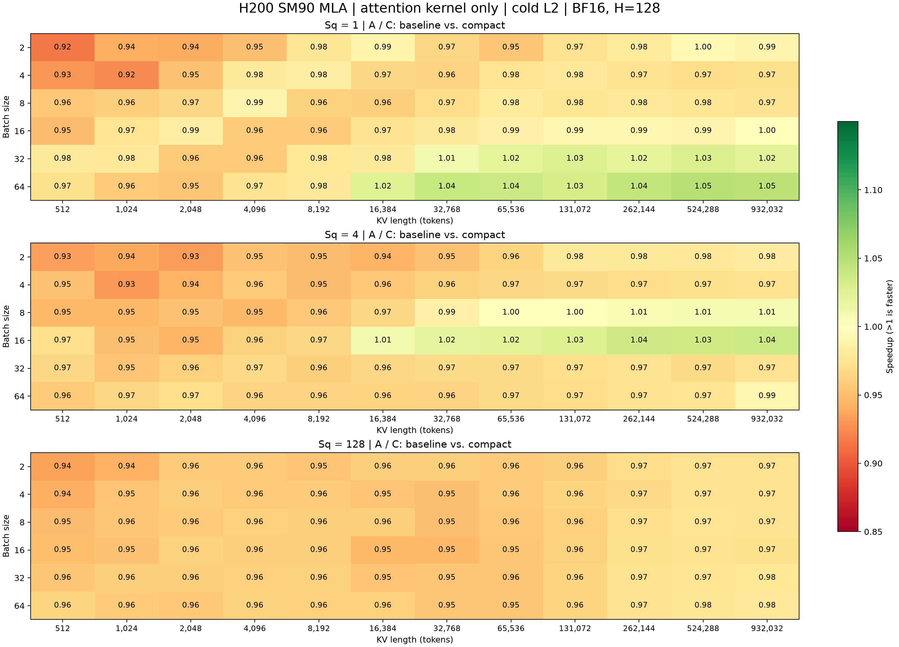

# H200 SM90 MLA：完整矩阵测量结果

**216 / 216** 个配置通过。最大 KV 长度统一为 **932,032**；各 Sq 均为同一张 batch × KV 矩阵。

A=原始调度/普通 KV，B=owner-local 调度/普通 KV，C=owner-local 调度/compact KV。均使用独立 merge，只计 attention kernel。加速比大于 1 表示后者更快。

全矩阵等权几何平均：A/C **0.970×**，A/B **1.004×**，B/C **0.967×**。

| Sq | 点数 | A/C 几何平均 | A/B 几何平均 | B/C 几何平均 | A/C 范围 | A/C >1.05 | A/C <0.95 |
| ---: | ---: | ---: | ---: | ---: | ---: | ---: | ---: |
| 1 | 72 | 0.980× | 0.996× | 0.984× | 0.916–1.050× | 0 | 6 |
| 4 | 72 | 0.970× | 1.009× | 0.962× | 0.930–1.037× | 0 | 12 |
| 128 | 72 | 0.961× | 1.007× | 0.954× | 0.935–0.979× | 0 | 7 |

各配置等权重；几何平均不是某种实际请求分布的端到端收益。±5% 仅用于描述点数，不是统计置信界。JSON 保留每个 block 的样本数及 p20/p80。

## 同一最大 KV 长度的边界列

| Sq | B | A (ms) | B (ms) | C (ms) | A/C |
| ---: | ---: | ---: | ---: | ---: | ---: |
| 1 | 2 | 0.993616 | 0.996432 | 1.003088 | 0.991× |
| 1 | 4 | 2.436960 | 2.440800 | 2.510032 | 0.971× |
| 1 | 8 | 4.414296 | 4.397432 | 4.533680 | 0.974× |
| 1 | 16 | 8.492544 | 8.524192 | 8.510560 | 0.998× |
| 1 | 32 | 16.887592 | 16.541816 | 16.512720 | 1.023× |
| 1 | 64 | 34.075087 | 32.430464 | 32.570224 | 1.046× |
| 4 | 2 | 4.155776 | 4.082248 | 4.225992 | 0.983× |
| 4 | 4 | 7.736528 | 7.660608 | 7.956272 | 0.972× |
| 4 | 8 | 15.444848 | 14.666608 | 15.353640 | 1.006× |
| 4 | 16 | 30.931944 | 28.786744 | 29.832168 | 1.037× |
| 4 | 32 | 58.371937 | 57.804263 | 60.057792 | 0.972× |
| 4 | 64 | 119.411463 | 116.443432 | 120.432014 | 0.992× |
| 128 | 2 | 112.400417 | 110.752554 | 115.639320 | 0.972× |
| 128 | 4 | 225.720921 | 221.675152 | 231.851784 | 0.974× |
| 128 | 8 | 451.772858 | 443.646126 | 464.565727 | 0.972× |
| 128 | 16 | 905.239426 | 889.620697 | 931.459030 | 0.972× |
| 128 | 32 | 1794.783447 | 1756.761475 | 1837.688965 | 0.977× |
| 128 | 64 | 3583.465210 | 3495.228577 | 3658.852234 | 0.979× |

## 结果解释

本轮已实现并验证 compact KV 的真实加载，但三个 Sq 子矩阵的总体几何平均均低于 1，未取得整体加速。个别配置的调度改善没有形成普遍的 compact 收益。

固定 owner-local 调度后，compact 相对普通 KV 的全矩阵几何平均也低于 1。这是存储布局和地址计算变化合在一起的净结果；本轮没有采集硬件计数器，不能据此确定某条指令或某一级内存是退化原因。

- Sq=1：67 个配置包含 split work，5 个配置只有 direct work。三条路径使用相同原始 plan。
- Sq=4：43 个配置包含 split work，29 个配置只有 direct work。三条路径使用相同原始 plan。
- Sq=128：0 个配置包含 split work，72 个配置只有 direct work。三条路径使用相同原始 plan。

[调度/存储消融图](ablation.png) · [全部时间 CSV](matrix.csv) · [原始 JSON](matrix.json) · [汇总 JSON](summary.json) · [实现及测量口径](README.md)
